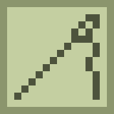

# stages [![1][1]][6]  [![2][2]][4]  [![3][3]][5] 

[][8]

tap to add text

[1]: https://img.shields.io/badge/minecraft-1.15+-brightgreen
[2]: https://img.shields.io/badge/loader-Fabric-blue
[3]: https://img.shields.io/badge/code_quality-F-red
[4]: https://fabricmc.net
[5]: https://git.io/code-quality
[6]: https://minecraft.net
[8]: https://www.curseforge.com/minecraft/mc-mods/fabric-api
[9]: https://www.curseforge.com/minecraft/mc-mods/fabric-language-kotlin
[10]: https://img.shields.io/badge/dynamic/json?color=orange&label=downloads&query=downloadCount&url=https%3A%2F%2Faddons-ecs.forgesvc.net%2Fapi%2Fv2%2Faddon%2F391014&logo=curseforge
[11]: https://www.curseforge.com/minecraft/mc-mods/slotlink
